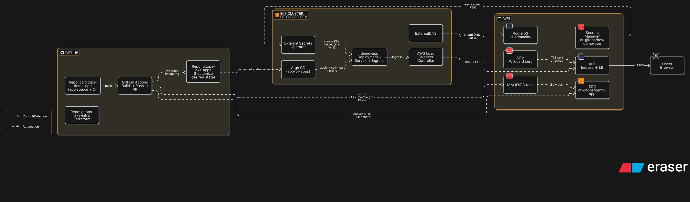

# ct-gitops v2 — GitOps on AWS EKS (Terraform + Argo CD + Kustomize + OIDC CI/CD)

This repo is a **beginner-friendly replication guide** for an “industry-style” GitOps v2 setup on AWS.

**What you build:**
- **Terraform** provisions AWS infra: VPC, EKS, IAM/IRSA, ECR, Route 53, ACM, Secrets Manager
- **Argo CD** reconciles cluster state from Git (**app-of-apps**)
- **Kustomize** manages env overlays (dev)
- **AWS Load Balancer Controller** creates ALB from Ingress
- **ExternalDNS** writes Route 53 records for Ingress hostnames
- **ACM** provides HTTPS (wildcard cert) and ALB redirects HTTP → HTTPS
- **External Secrets Operator (ESO)** syncs values from **AWS Secrets Manager** into Kubernetes Secrets
- **GitHub Actions (OIDC)** builds/pushes images to ECR and opens a **PR** to the GitOps repo to bump the image tag → merge → Argo deploy

> Reference live demo (my environment): https://demo.p1.cloudwithtanmay.com

---

## Repos you fork (source of truth)

Fork these repos into your GitHub account:

1) Infra (Terraform): https://github.com/tanmayj-hub/gitops-eks-infra  
2) GitOps (Argo apps + Kustomize): https://github.com/tanmayj-hub/gitops-eks-apps  
3) Demo app (source + CI): https://github.com/tanmayj-hub/ct-gitops-demo-app

This guide repo is documentation only.

---

## Quick start (recommended order)

1) Prereqs: `docs/00-prereqs.md`  
2) Fork/clone + required edits: `docs/01-repo-setup.md`  
3) Remote Terraform state (S3 + DynamoDB): `docs/02-remote-state.md`  
4) Infra apply (EKS/VPC/ECR/Route53/ACM/Secrets/OIDC role): `docs/03-eks-infra.md`  
5) Add-ons apply (LBC/ArgoCD/ExternalDNS/ESO): `docs/04-addons.md`  
6) GitOps bootstrap (app-of-apps): `docs/05-argocd-bootstrap.md`  
7) Demo app deploy: `docs/06-demo-app.md`  
8) Public Ingress + DNS + HTTPS: `docs/07-ingress-dns-tls.md`  
9) Secrets baseline (ESO): `docs/08-secrets-eso.md`  
10) CI/CD (OIDC → ECR → GitOps PR): `docs/09-cicd-oidc-gitops-pr.md`  
11) Destroy safely: `docs/10-destroy.md`

---

## Defaults used in the reference project

- AWS region: `us-east-2`
- Project slug: `ct-gitops`
- Env: `dev`
- EKS cluster name: `ct-gitops-dev`
- Hosted zone (delegated sub-zone): `p1.cloudwithtanmay.com`
- Demo hostname: `demo.p1.cloudwithtanmay.com`

You can change these, but keep them consistent across repos.

## Your values (fill these once)

| Item | Example |
|---|---|
| GitHub username | yourname |
| AWS region | us-east-2 |
| Project slug | ct-gitops |
| Root domain | p1.example.com |
| Demo hostname | demo.p1.example.com |

---

## Architecture diagram (Eraser)

- Source (Eraser diagram-as-code): `docs/ct-gitops-v2-architecture.eraserdiagram`
- Exports:
  - `assets/architecture.png`
  - `assets/architecture.svg`
---

## Proof screenshots

A curated screenshot checklist is in:
- `assets/screenshots/README.md`

---

## Cost note (important)

EKS + NAT Gateway + ALB can cost money if left running. Use `docs/10-destroy.md` when finished.

---

## Next sprint items (optional)

This guide intentionally defers:
- Stage 11: 3-tier app in-cluster DB (learning)
- Stage 12: RDS upgrade (industry DB)
You can add those later without changing the GitOps foundation.
